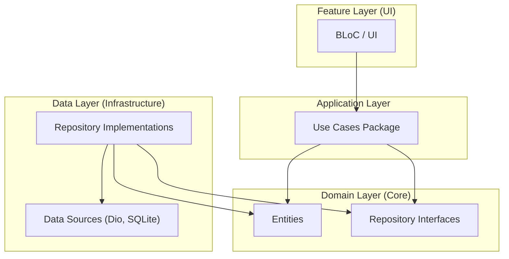
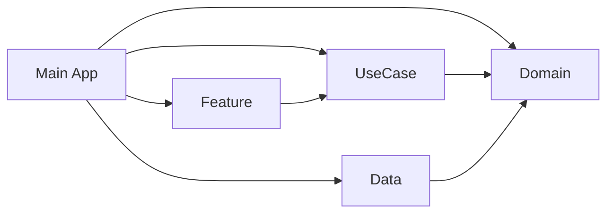

# Layer Interaction & Access Rules

This document explains how different layers in the monorepo interact and the rules for accessing each other, following Clean Architecture principles.

## Dependency Flow

Dependencies point inwards. Inner layers (Domain) are independent of outer layers (Data, Feature).

## Access Rules & Interaction

### 1. Presentation Layer (Feature Packages)
Contains BLoCs, Pages, and UI Widgets.
- **Access Goal**: To execute business logic and display state.
- **Access Rule**: 
    - ✅ **MUST** call Use Cases from the `use_cases` package.
    - ✅ **CAN** access Entities from the `domain` package for displaying data.
    - ❌ **NEVER** call Repository Interfaces directly.
    - ❌ **NEVER** depend on the `data` package.

### 2. Application Layer (Use Cases Package)
Contains the "interactors" or application logic.
- **Access Goal**: To coordinate business rules.
- **Access Rule**:
    - ✅ **MUST** call Repository Interfaces from `domain`.
    - ✅ **MUST** use Entities from `domain`.
    - ❌ **NEVER** depend on Feature layers.
    - ❌ **NEVER** depend on Data implementations.

### 3. Domain Layer (Domain Package)
The most stable layer. Contains the business models and contracts.
- **Access Goal**: To define the language and contracts of the business.
- **Access Rule**:
    - ✅ **MUST** be independent of all other business layers.
    - ✅ **CAN** depend on `app_core` for foundational types (Result, Failure).
    - ❌ **NEVER** depend on `use_cases`, `data`, or `feature`.

### 4. Data Layer (Data Package)
Infrastructure implementations.
- **Access Goal**: To provide data from external sources.
- **Access Rule**:
    - ✅ **MUST** implement Repository Interfaces from `domain`.
    - ✅ **MUST** return Entities from `domain`.
    - ✅ **CAN** depend on `app_core` and external libraries (Dio, drift, shared_preferences).
    - ❌ **NEVER** depend on `use_cases` or `feature`.

---

## Practical Example: Fetching a User

| Step | Layer | Action |
|------|-------|--------|
| 1 | **UI** | User clicks "Profile" button. |
| 2 | **Feature (BLoC)** | Emits `LoadUserEvent`, calls `GetUserUseCase(userId)`. |
| 3 | **Use Case** | Validates `userId`, calls `UserRepository.getUserById(userId)`. |
| 4 | **Data (Repo Impl)** | Calls Dio to API `/users/{id}`, converts JSON to `UserEntity`. |
| 5 | **Domain (Interface)** | The `UserRepository` (interface) is what the Use Case sees. |
| 6 | **DI (App)** | Injects `UserRepositoryImpl` where `UserRepository` is requested. |

## Dependency Injection (DI)

The `app` package is the only one that "knows" about everything to perform the wiring:

